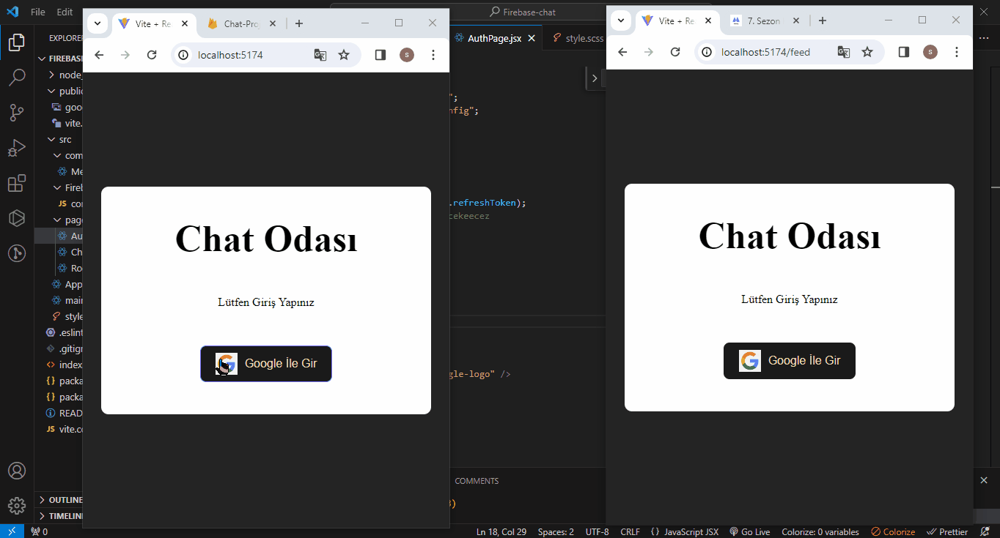

<h2>Firebase-Responsive Chat Project</h2>

Proje içeriğinde;
- Kullanıcı Kimliğinin Doğrulama asaması
- Kullanıcının sahip olduğu email-şifre 
ile kimliğini doğrulayabilriz.
- Authentication (Kimlik Doğrulama) ve  Authorization (Yetkilendirme) özellikleri kullanılmıştır
- Ayrıca responsive tarzında site ekran özellikleri bulunmaktadır

<h3>Kullanılan Teknolojiler</h3>

Bu projede HTML, SCSS, Javascript teknolojileri kullanılmıştır.

<h4>Projeye ait ekran resmi</h4>

